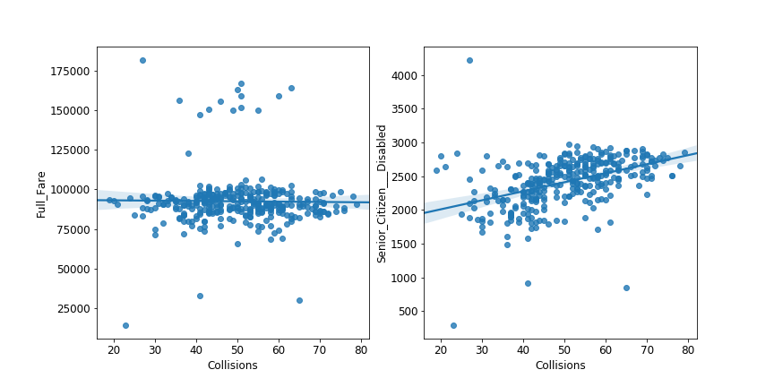

Recently, I teamed up with a few fellow grad students at NYU to compete in a datathon sponsored by [Enigma](enigma.com), who provided several datasets related to public transit in NYC and instructed teams to use them for analysis in a very open-ended way. Our team decided to look at three different metrics - subway ridership, traffic, and subway performance - and see if we could find any interesting relationships between them.

Due to the time constraints of the datathon, we immediately had to make some difficult choices. Instead of trying to quantify traffic conditions, we found a database of motor vehicle collisions and decided to count the number of collisions near a station, and compare this to ridership. For a given station, did more collisions nearby correlate with more or fewer riders, or neither? Could we outline a plausible chain of events where more collisions correlates with more riders, which in turn leads to overcrowding and lower performance ratings at the station?

We weren't able to solve all of these questions, but we did discover an interesting trend across many of the stations around the city. In general, ridership of full fare metrocards did not correlate highly (or significantly at all) with collisions, but senior citizen and disabled ridership did. At stations near Jamaica Center in Queens, for example, the difference is particularly noticeable:

